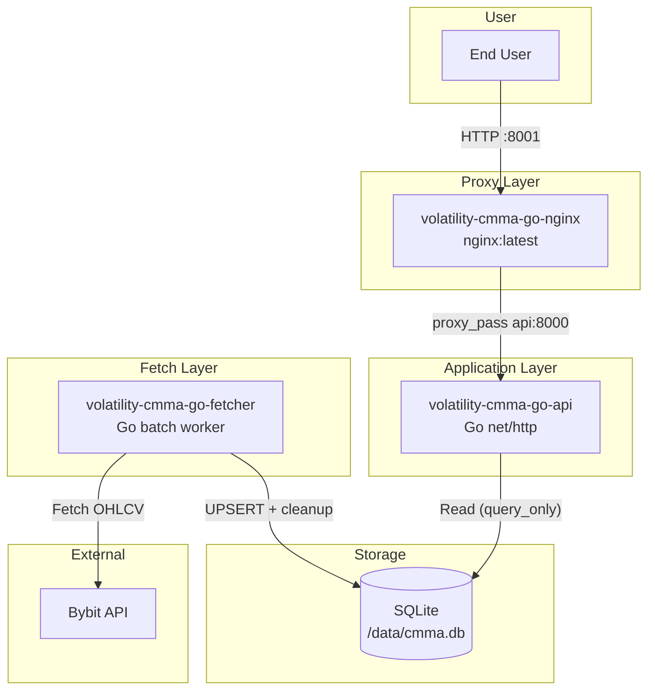

# volatility-cmma-go (crypto market metrics api)

`volatility-cmma` の Go 実装版です。Bybit の USDT 無期限契約 OHLCV を定期収集し、価格変動率と出来高ランキングを API で提供します。

## 機能

- データ収集 (`fetcher`)
  - Bybit API から全 USDT 無期限契約の OHLCV を定期取得
  - SQLite (`./data/cmma.db`) に UPSERT 保存
  - タイムフレーム別テーブル (`ohlcv_1m`, `ohlcv_5m` など) を利用
  - goroutine + semaphore で並列取得（`CONCURRENCY_LIMIT` で制御）

- API サーバー (`api`)
  - `/volatility` で価格変動率の抽出
  - `/volume` で指定期間の出来高・売買代金ランキング
  - go-openapi による Swagger UI / OpenAPI JSON を提供
  - 統一形式のエラーレスポンスを返却

- プロキシ (`nginx`)
  - `localhost:8001` で外部公開
  - `api:8000` にリバースプロキシ

## 必要要件

- Docker
- Docker Compose (`docker-compose`)

## 実行方法

1. 環境変数ファイルを作成

```bash
cp .env.example .env
```

2. 起動

```bash
docker-compose up --build
```

バックグラウンド実行:

```bash
docker-compose up --build -d
```

3. ログ確認

```bash
docker-compose logs -f volatility-cmma-go-fetcher
docker-compose logs -f volatility-cmma-go-api
docker-compose logs -f volatility-cmma-go-nginx
```

## 環境変数

- `TIMEFRAMES`
  - 取得タイムフレーム (例: `1m,5m,15m,1h,4h,1d`)
- `FETCH_INTERVAL_SECONDS`
  - 取得サイクル間隔 (秒)
- `OHLCV_HISTORY_LIMIT`
  - 銘柄ごとの保持ローソク足本数
  - `/volatility` の `offset` 上限や `/volume` の計算可能期間に影響
- `CONCURRENCY_LIMIT`
  - Bybit API 同時リクエスト数
- `BYBIT_BASE_URL` (任意)
  - デフォルト: `https://api.bybit.com`
- `DB_PATH` (任意)
  - デフォルト: `/app/data/cmma.db`

## API 利用方法

API は `http://localhost:8001` で利用できます。

### API ドキュメント

- Swagger UI: `http://localhost:8001/volatility/docs`
- OpenAPI JSON: `http://localhost:8001/volatility/openapi.json`

### エンドポイント: `GET /volatility`

価格変動率が閾値以上の銘柄を取得します。

クエリパラメータ:

- `timeframe` (必須)
  - 有効値: `1m, 5m, 15m, 30m, 1h, 4h, 1d, 1w, 1M`
- `threshold` (必須, > 0)
  - 価格変動率閾値(%)
- `offset` (任意, デフォルト: `1`)
  - 何本前のローソク足と比較するか
- `direction` (任意, デフォルト: `both`)
  - `up`, `down`, `both`
- `sort` (任意, デフォルト: `volatility_desc`)
  - `volatility_desc`, `volatility_asc`, `symbol_asc`
- `limit` (任意, デフォルト: `100`, 範囲: `1..500`)

使用例:

```bash
curl -s "http://localhost:8001/volatility?timeframe=4h&threshold=5&direction=up&sort=volatility_desc"
```

### エンドポイント: `GET /volume`

指定期間の出来高ランキングを取得します。

クエリパラメータ:

- `timeframe` (必須)
  - 有効値: `1m, 5m, 15m, 30m, 1h, 4h, 1d, 1w, 1M`
- `period` (必須)
  - 有効値: `1h, 6h, 12h, 24h, 1d, 7d, 1w, 1M`
- `min_volume` (任意, > 0)
  - 足切り値
- `min_volume_target` (任意, デフォルト: `turnover`)
  - `volume`, `turnover`
- `sort` (任意, デフォルト: `volume_desc`)
  - `volume_desc`, `volume_asc`, `turnover_desc`, `turnover_asc`, `symbol_asc`
- `limit` (任意, デフォルト: `100`, 範囲: `1..500`)

使用例:

```bash
curl -s "http://localhost:8001/volume?timeframe=1h&period=24h&min_volume=500000000&min_volume_target=turnover&sort=turnover_desc"
```

### エラーレスポンス

```json
{
  "error": {
    "code": "INVALID_TIMEFRAME",
    "message": "無効なタイムフレームです。有効な値: 1m, 5m, ..."
  }
}
```

主なエラーコード:

- `INVALID_TIMEFRAME`
- `INVALID_PERIOD`
- `INSUFFICIENT_HISTORY`
- `INVALID_INPUT`
- `INTERNAL_ERROR`

## 注意事項

- Bybit レートリミットにより `retCode=10006` が発生する場合があります。
- `CONCURRENCY_LIMIT` は同一IPの他システム利用状況に合わせて調整してください。
- `OHLCV_HISTORY_LIMIT` が小さいと `/volume` の長期間集計で `INSUFFICIENT_HISTORY` になります。

## 停止

```bash
docker-compose down
```

DB を初期化したい場合は `./data/cmma.db` を削除してください。

## システム構成

- `fetcher`: Bybit API から取得して SQLite に書き込み
- `api`: SQLite を読み取り API 返却
- `nginx`: 外部公開エンドポイント

データフロー:

1. `fetcher` が Bybit から OHLCV を取得
2. `fetcher` が `./data/cmma.db` に保存
3. ユーザーが `localhost:8001` にリクエスト
4. `nginx` が `api:8000` へ転送
5. `api` が DB を参照してレスポンス返却

### Mermaid ダイアグラム


